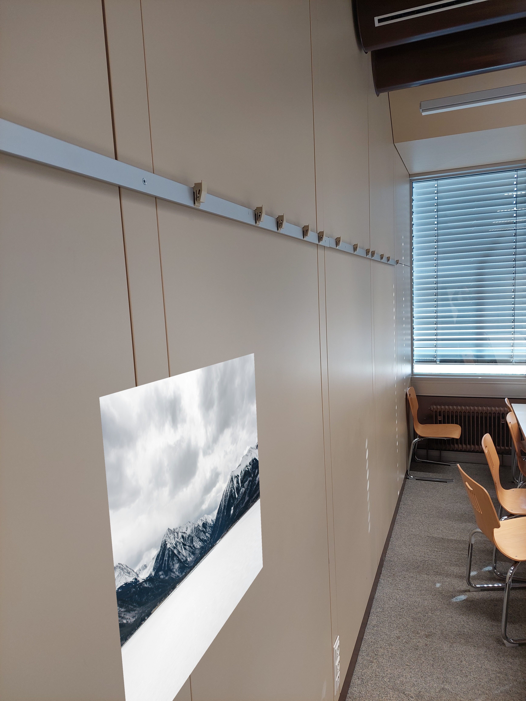

# 🧠 Augmented Reality with ArUco Markers

This project demonstrates a simple augmented reality system using ArUco markers and OpenCV. It overlays a poster image onto a wall in a scene by detecting ArUco markers and applying a perspective transformation.

Developed as part of the Computer Vision coursework at RWU Hochschule Ravensburg-Weingarten.

---

## 📌 Project Overview

- 📷 Detects ArUco markers in a series of input images
- 🖼️ Warps and overlays a poster image onto the detected marker region
- 🔍 Evaluates the transformation visually using masks and intermediate outputs
- 🧪 Includes your own recordings with strong perspective transformations

---

## 🛠️ Technologies Used

- Python 3.10+
- OpenCV (with ArUco module)
- NumPy

---

## 📁 Folder Structure
AugmentedReality_ARUCO/ ├── main.py                  # Main script ├── requirements.txt         # Python dependencies ├── README.md                # Project documentation ├── input_images/            # Input images with ArUco markers ├── poster/                  # Poster image to augment ├── results/                 # Final augmented images ├── wrapped_poster/          # Warped poster images ├── inverse_mask/            # Binary masks for blending ├── background/              # Backgrounds after masking └── foreground/              # Foreground poster regions


---

## 🚀 How to Run

1. **Clone the repository**

git clone https://github.com/<Atharvadahitule>/AugmentedReality_ARUCO.git
cd AugmentedReality_ARUCO

2. **Install dependencies**
pip install -r requirements.txt

3. **Add your images**
- Place your input images in input_images/ (e.g., image1.jpg, image2.jpg, …)
- Place your poster image in poster/ as poster1.jpg

4. **Run the script**
python main.py


5. **Check the output**
- Augmented results will be saved in the results/ folder
- Intermediate outputs (masks, warped posters, etc.) will be saved in their respective folders


🧪 Sample Output
Example: Poster accurately placed on a wall using ArUco marker detection and homography transformation.

Example: Poster accurately placed on a wall using ArUco marker detection and homography transformation.


Absolutely, Atharva! Here's a complete README.md you can copy and paste directly into your GitHub project. It includes:
- ✅ Project overview
- ✅ Folder structure
- ✅ Setup instructions
- ✅ Reference links
- ✅ Sample output image (you’ll need to replace the placeholder with your actual image filename)

# 🧠 Augmented Reality with ArUco Markers

This project demonstrates a simple augmented reality system using ArUco markers and OpenCV. It overlays a poster image onto a wall in a scene by detecting ArUco markers and applying a perspective transformation.

Developed as part of the Computer Vision coursework at RWU Hochschule Ravensburg-Weingarten.

---

## 📌 Project Overview

- 📷 Detects ArUco markers in a series of input images
- 🖼️ Warps and overlays a poster image onto the detected marker region
- 🔍 Evaluates the transformation visually using masks and intermediate outputs
- 🧪 Includes your own recordings with strong perspective transformations

---

## 🛠️ Technologies Used

- Python 3.10+
- OpenCV (with ArUco module)
- NumPy

---

## 📁 Folder Structure


AugmentedReality_ARUCO/ ├── main.py                  # Main script ├── requirements.txt         # Python dependencies ├── README.md                # Project documentation ├── input_images/            # Input images with ArUco markers ├── poster/                  # Poster image to augment ├── results/                 # Final augmented images ├── wrapped_poster/          # Warped poster images ├── inverse_mask/            # Binary masks for blending ├── background/              # Backgrounds after masking └── foreground/              # Foreground poster regions

---

## 🚀 How to Run

1. **Clone the repository**

```bash
git clone https://github.com/<your-username>/AugmentedReality_ARUCO.git
cd AugmentedReality_ARUCO


2. **Install dependencies**

pip install -r requirements.txt


3. **Add your images**
- Place your input images in input_images/ (e.g., image1.jpg, image2.jpg, …)
- Place your poster image in poster/ as poster1.jpg

4. **Run the script**
python main.py

5. **Check the output**
- Augmented results will be saved in the results/ folder
- Intermediate outputs (masks, warped posters, etc.) will be saved in their respective folders

🧪 Sample Output
Here’s an example of the augmented result:
[](https://github.com/Atharvadahitule/AugmentedReality_ARUCO)
Poster placed accurately on the wall using ArUco marker detection and homography transformation.


📚 References
- 📘 [OpenCV ArUco Documentation](https://docs.opencv.org/4.x/d5/dae/tutorial_aruco_detection.html)
- 🧩 [ArUco Marker Generator] (https://chev.me/arucogen/)
- 📖 RWU Computer Vision Task 1: Augmented Reality (Course Material)

👨‍🎓 Author
Atharva U. Dahitule
Master’s Student, Mechatronics Engineering
RWU Hochschule Ravensburg-Weingarten, Germany

---

